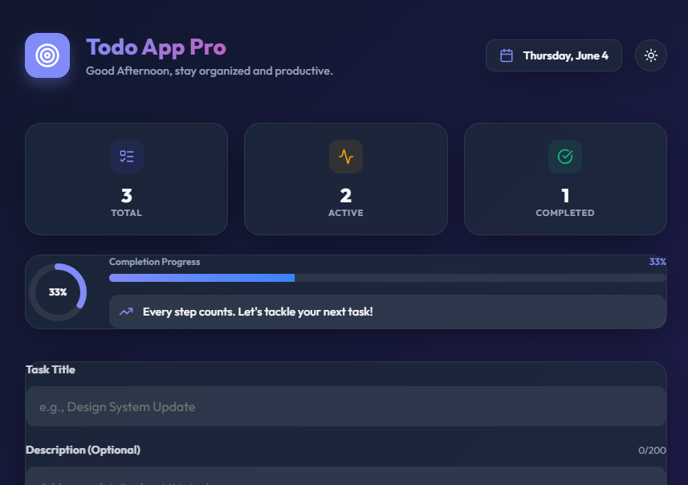
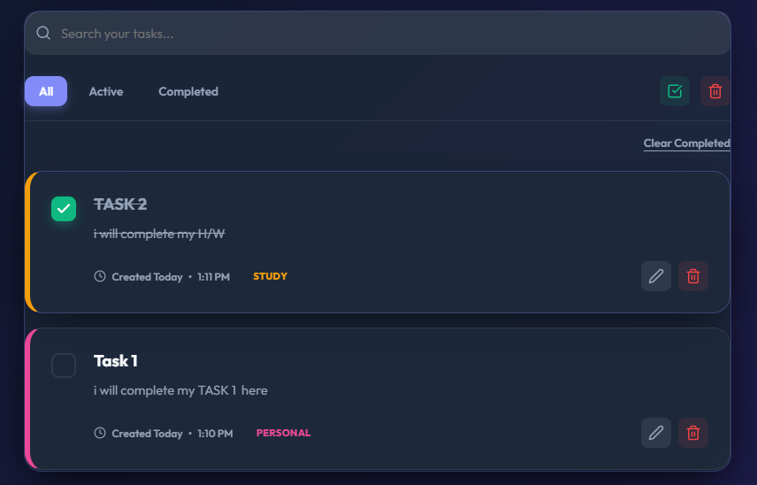
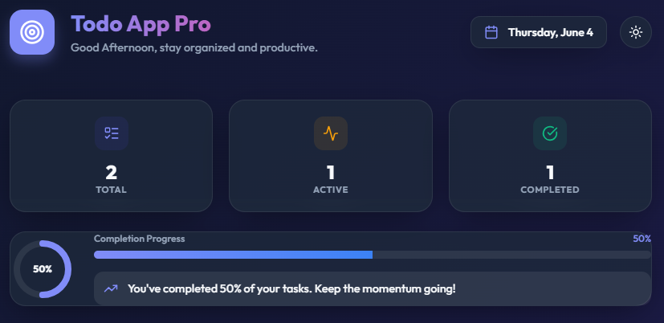
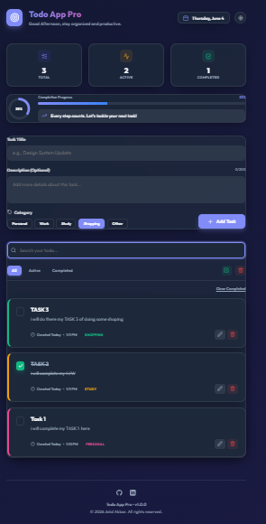

<div align="center">

# Todo App Pro 🚀
**A Premium, SaaS-Grade Productivity Dashboard**

[](https://react.dev/)
[](https://vitejs.dev/)
[](LICENSE)
[](https://github.com/jalalakbar47)

[Live Demo](https://your-demo-link.vercel.app) • [Report Bug](https://github.com/jalalakbar47/todo-app-pro/issues) • [Request Feature](https://github.com/jalalakbar47/todo-app-pro/issues)


</div>

---

## 📖 About Todo App Pro

**Todo App Pro** is not just another todo list—it's a high-fidelity productivity dashboard designed to mirror the aesthetics of modern SaaS applications. Built for developers who value design as much as functionality, it features a stunning **Glassmorphism UI**, real-time analytics, and a seamless adaptive theme system.

Whether you're managing complex work tasks or organizing your daily routine, Todo App Pro provides a smooth, fluid, and visually rewarding experience.

### Why this project?
- **SaaS Aesthetics**: Forget generic tables; enjoy a card-based dashboard layout.
- **Data Persistence**: All your tasks stay exactly where you left them, even after a refresh.
- **Performance First**: Zero bloat, tree-shakable icons, and lightning-fast Vite bundling.

---

## ✨ Features

- **💎 High-End UI/UX**: Professional glassmorphism design with responsive gradients and premium Outfit typography.
- **🌓 Adaptive Themes**: Instant Light and Dark mode switching with persistent user preference storage.
- **📊 Real-time Statistics**: 
  - **Animated Metrics**: Stats that count up dynamically as you complete tasks.
  - **Progress Ring & Bar**: Visual feedback on your productivity status.
- **📝 Intelligent Task Management**:
  - **Descriptions**: Multiline task details with character limits for clean formatting.
  - **Categorization**: Color-coded badges for Work, Personal, Study, Shopping, and more.
  - **Smart Timestamps**: Relative time formatting (e.g., "Created Today at 2:45 PM").
- **🔍 Global Search**: Instant filtering through task titles and detailed descriptions.
- **⚡ Batch Operations**: Mark all tasks as complete or clear your dashboard with one click.
- **💾 100% Offline**: LocalStorage integration ensures your data is always available without a backend.

---

## 📸 Screenshots

<div align="center">

### 🌙 Dark mode Dashboard


### 📝 Task Detailed Management


### 📊 Real-time Progress Tracking


### 📱 Fully Responsive Layout


</div>

---

## 🛠️ Tech Stack

- **Core**: [React 19](https://reactjs.org/) (State, Props, Hooks)
- **Build Tool**: [Vite 6](https://vitejs.dev/) (HMR, Optimized Bundling)
- **Icons**: [Lucide React](https://lucide.dev/) (Individual tree-shakable imports)
- **Styling**: Vanilla CSS3 (Custom Design System, CSS Variables, Glassmorphism)
- **Persistence**: Web Storage API (LocalStorage)

---

## 🚀 Getting Started

### Prerequisites

- Node.js (Latest LTS recommended)
- npm or yarn

### Installation

1. **Clone the repository**
   ```bash
   git clone https://github.com/jalalakbar47/Todo-app-pro.git
   ```

2. **Install dependencies**
   ```bash
   cd todo-app-pro
   npm install
   ```

3. **Start Development**
   ```bash
   npm run dev
   ```

4. **Production Build**
   ```bash
   npm run build
   ```

---

## 📂 Folder Structure

```text
src/
├── components/
│   ├── Header.jsx       # Greeting, Date & Theme Logic
│   ├── TodoForm.jsx     # Expanded Input with Category Selection
│   ├── TodoList.jsx     # Smart List Container
│   ├── TodoItem.jsx     # Individual Task Cards with Descriptions
│   ├── TodoStats.jsx    # Animated Statistics Dashboard
│   ├── ProgressRing.jsx  # SVG-based Completion Circle
│   ├── SearchBox.jsx    # Real-time Filter Input
│   └── ...              # Modals, Toasts, and Badges
├── utils/
│   ├── localStorage.js  # Persistence Layer
│   └── dateUtils.js     # Time Formatting & Greeting Engine
├── App.jsx              # Main Application Orchestrator
└── index.css            # Global Design System & SaaS Theme
```

---

## 🔮 Future Roadmap

- [ ] **Cloud Sync**: Optional integration with Firebase or Supabase.
- [ ] **Drag-and-Drop**: Interactive task reordering.
- [ ] **Sub-tasks**: Nested checklists within each task description.
- [ ] **Priority Routing**: High/Medium/Low priority filtering.

---

## 👨‍💻 Author & Dedication

Created with ❤️ by **Jalal Akbar**

> Dedicated To My ❤️ J/S — My Inspiration.

[](https://github.com/jalalakbar47)

---

## 📄 License

Distributed under the MIT License. See `LICENSE` for more information.

---
<div align="center">
Built with passion for a professional portfolio.
</div>
